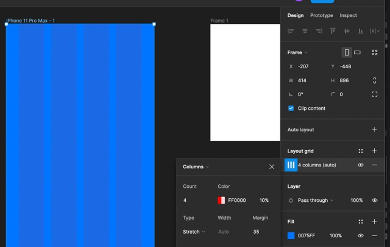
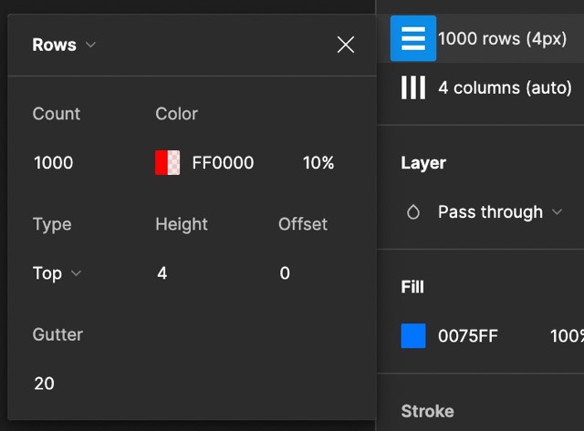
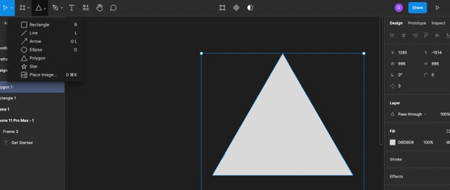
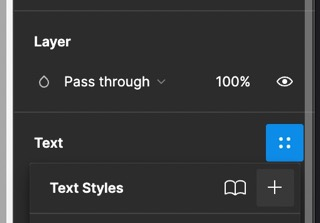
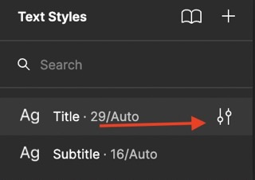
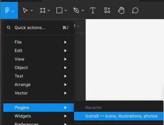
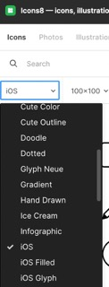
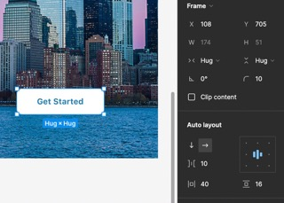
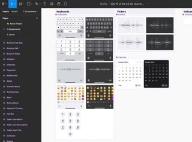

#  Figma Design Notes

# Standard Grids
Use the standard grid patterns, so that creating new shapes always fits withint the design for the grid.
For mobile phones the standard for grids is four columns with 35 px margin as shown below in Figma:

Meanwhile, you also create another grid with 1,000 rows of height four:

# Custom Shapes
All graphics created within Figma are Vector-based graphics, which means it will never pixelate with
increasing size.

You can use the polygon tool to make a custom shape with the number of sides specified:

# Fonts
Drag the font for the size of the box you want the text to remain within. For Apple devices, the default
system font is SF Pro.

You should aim for 45 characters of text per line/ no more, or risk that the text becomes unreadable for some people.

## Regular Size
For regular font, you use between 11 to 19 font size with 120% for the line height. 

## Headline
For headline size fonts, you use the size between 20 to 34. 

## Consistent Styles
You can re-use the same style of Text throughout your design by creating a new style. To do this, you click the 
style button next to the text followed by the plus button, which allows you to save your new style:

Later, you can change this in a single spot by going under the properties for the style:

# Colors
Three principles:
1. Use complementary colors on the opposite side of the color wheel.
1. Intentionally choose colors
  - Use to draw someone's attention
  - Repeat for visual cues
1. Understand the 60 - 30 - 10 rule
  - 60% primary color
  - 30% for complementary (secondary color)
  - 10% for accent color

You can save the color styles for a consistent look throughout the app. You can use strokes, gradients or solid colors.

# Icons
Icons8 provides free icons as a plugin within Figma. You can use icons by going to the Plugins from the menu:

Then, you can use iOS specific icons by selecting it from the dropdown within the icons8 plugin:

# Photos
The most popular photos plugin is Unsplash as of August 18, 2022, so add this plugin to your Figma. 
You can then search for photos to drop onto your canvas. From here, drag the photo onto a frame to put it inside of it.
Once you get the sizing right, you can crop the unneeded portion of the photo. 

# Buttons
You can use the frame tool (f shortcut), then click to create a new frame. From here, switch to the Text tool (t shorcut),
then type inside the frame. Next, use SHIFT + A to apply auto-layout, then you can have a button with the following settings:

# UI Kit
A UI Kit has all of the design components already created for you. From here, you can copy the component directly into your
Figma design file saving you much time in order to get the proper iOS look.

